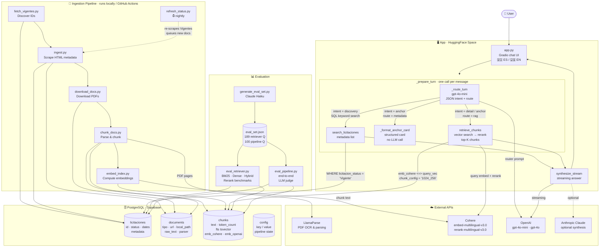

```mermaid
flowchart TB
    USER(["👤 User"])

    subgraph PIPELINE["🔄 Ingestion Pipeline  ·  runs locally / GitHub Actions"]
        direction LR
        FV["fetch_vigentes.py\nDiscover IDs"]
        IN["ingest.py\nScrape HTML metadata"]
        DL["download_docs.py\nDownload PDFs"]
        CH["chunk_docs.py\nParse & chunk"]
        EM["embed_index.py\nCompute embeddings"]
        RS["refresh_status.py\n⏰ nightly"]

        FV --> IN --> DL --> CH --> EM
        RS -.->|re-scrapes Vigentes\nqueues new docs| IN
    end

    subgraph DB["🗄️ PostgreSQL · Supabase"]
        direction TB
        TL[("licitaciones\nid · status · dates\nmetadata")]
        TD[("documents\ntipo · url · local_path\nraw_text · parser")]
        TC[("chunks\ntext · token_count\nfts tsvector\nemb_cohere · emb_openai")]
        CF[("config\nkey / value\npipeline state")]
    end

    subgraph APIS["☁️ External APIs"]
        direction TB
        LP["LlamaParse\nPDF OCR & parsing"]
        CO["Cohere\nembed-multilingual-v3.0\nrerank-multilingual-v3.0"]
        OA["OpenAI\ngpt-4o-mini  ·  gpt-4o"]
        AN["Anthropic Claude\noptional synthesis"]
    end

    subgraph APP["🖥️ App · HuggingFace Space"]
        direction TB
        UI["app.py\nGradio chat UI\n🇲🇽 ES  /  🇺🇸 EN"]

        subgraph TURN["_prepare_turn  ·  one call per message"]
            direction LR
            RT["_route_turn\ngpt-4o-mini\nJSON intent + route"]
            RT -->|"intent = discovery\nSQL keyword search"| META
            RT -->|"intent = anchor\nroute = metadata"| CARD
            RT -->|"intent = detail / anchor\nroute = rag"| RAG

            META["search_licitaciones\nmetadata list"]
            CARD["_format_anchor_card\nstructured card\nno LLM call"]
            RAG["retrieve_chunks\nvector search → rerank\ntop-K chunks"]
        end

        SYN["synthesize_stream\nstreaming answer"]

        UI --> TURN
        META --> SYN
        RAG --> SYN
    end

    subgraph EVAL["📊 Evaluation"]
        direction LR
        GE["generate_eval_set.py\nClaude Haiku"]
        ES[("eval_set.json\n189 retriever Q\n100 pipeline Q")]
        ER["eval_retriever.py\nBM25 · Dense · Hybrid\nRerank benchmarks"]
        EP["eval_pipeline.py\nend-to-end\nLLM judge"]

        GE --> ES --> ER & EP
    end

    %% Pipeline → DB
    FV & IN --> TL
    IN --> TD
    DL --> TD
    CH --> TD & TC
    EM --> TC

    %% Pipeline → APIs
    CH -->|PDF pages| LP
    EM -->|chunk text| CO

    %% App → DB
    META -->|"WHERE licitacion_status = 'Vigente'"| TL
    RAG -->|"emb_cohere <=> query_vec\nchunk_config = '1024_256'"| TC

    %% App → APIs
    RT -->|router prompt| OA
    RAG -->|query embed + rerank| CO
    SYN -->|streaming| OA
    SYN -.->|optional| AN

    %% Eval → DB
    ER & EP --> TC & TL

    %% User
    USER --> UI
    SYN --> UI
```
